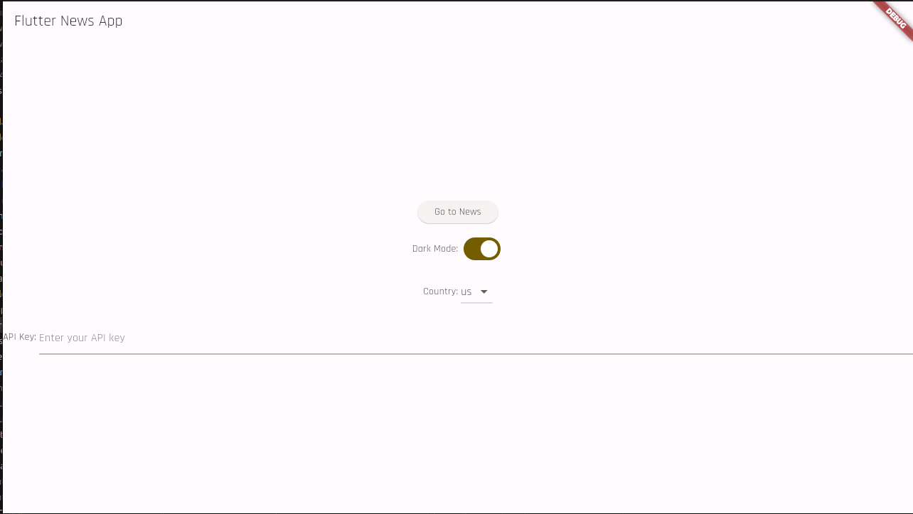
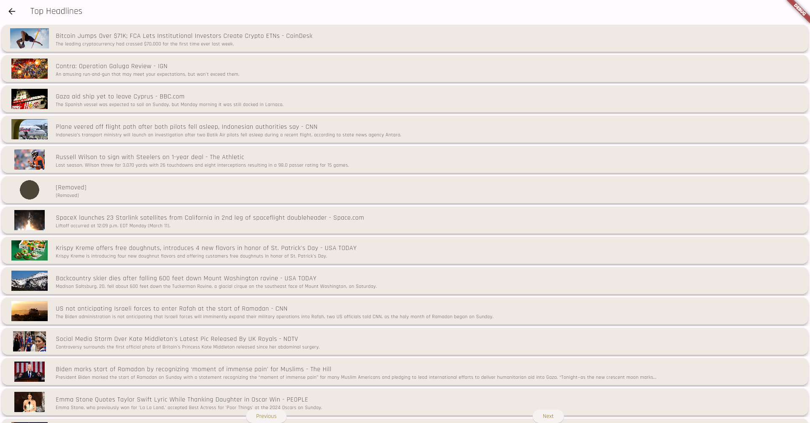

# Flutter News Viewer

## Description
Flutter News Viewer is a small application built with Flutter that allows users to view and read news articles from various sources.

## Features
- Browse news articles
- Light and Dark theme
- bring your own api key

## Installation
### Linux
1. Clone the repository: `git clone https://github.com/your-username/flutter_news_viewer.git`
2. Change to the project directory: `cd flutter_news_viewer`
3. Install dependencies: `flutter pub get`
4. Run the app: `flutter run`
### Android
1. Download the apk from release/app-release.apk to your device
2. Tap the apk file, select install, confirm
## Screenshots

## Contributing
Contributions are welcome! If you find any bugs or have suggestions for new features, please open an issue or submit a pull request.

## License
This project is licensed under the [MIT License](LICENSE).

## Contact
For any questions or inquiries, please contact [rudenko.ad@phystech.edu](mailto:rudenko.ad@phystech.edu).
