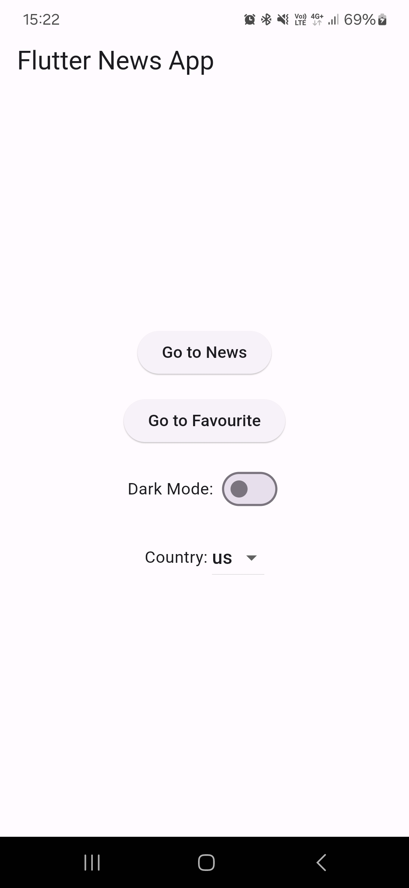
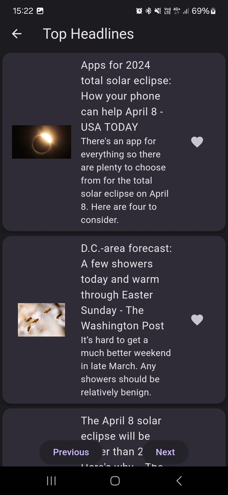
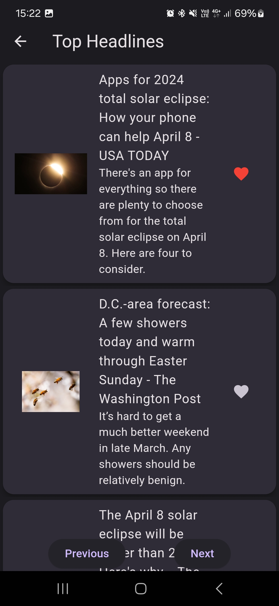
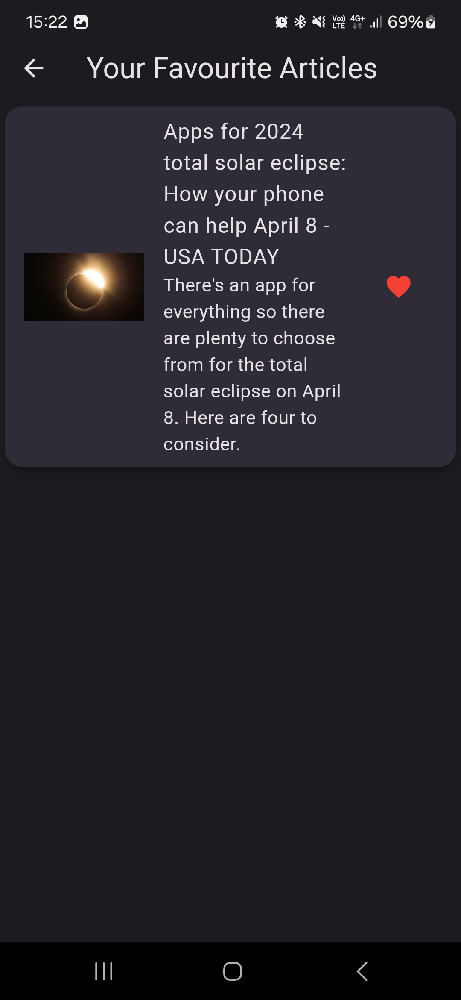

# Flutter News Viewer

## Description
Flutter News Viewer is a small application built with Flutter that allows users to view and read news articles sourced from [NewsAPI](https://newsapi.org/).

## Features
- Browse news articles
- Select a country to view the news from (some countries, such as us, may work better than others, such as Russia, due to NewsAPI not having equal reach)
- Light and Dark theme
- Favourite articles to view them at any time

## Installation
1. Download the APK from the [latest release](https://github.com/RudenkoAD/flutter_news_viewer/releases).
2. Tap the APK file, select install, and confirm.

## Screenshots
Main Menu | News Page(dark mode)
:--------:|:----------:
|
Favourite Button | Favourite Page
 | 

## Contributing
Contributions are welcome! If you find any bugs or have suggestions for new features, please open an issue or submit a pull request.

## License
This project is licensed under the [MIT License](LICENSE).

## Contact
For any questions or inquiries, please contact [rudenko.ad@phystech.edu](mailto:rudenko.ad@phystech.edu).
